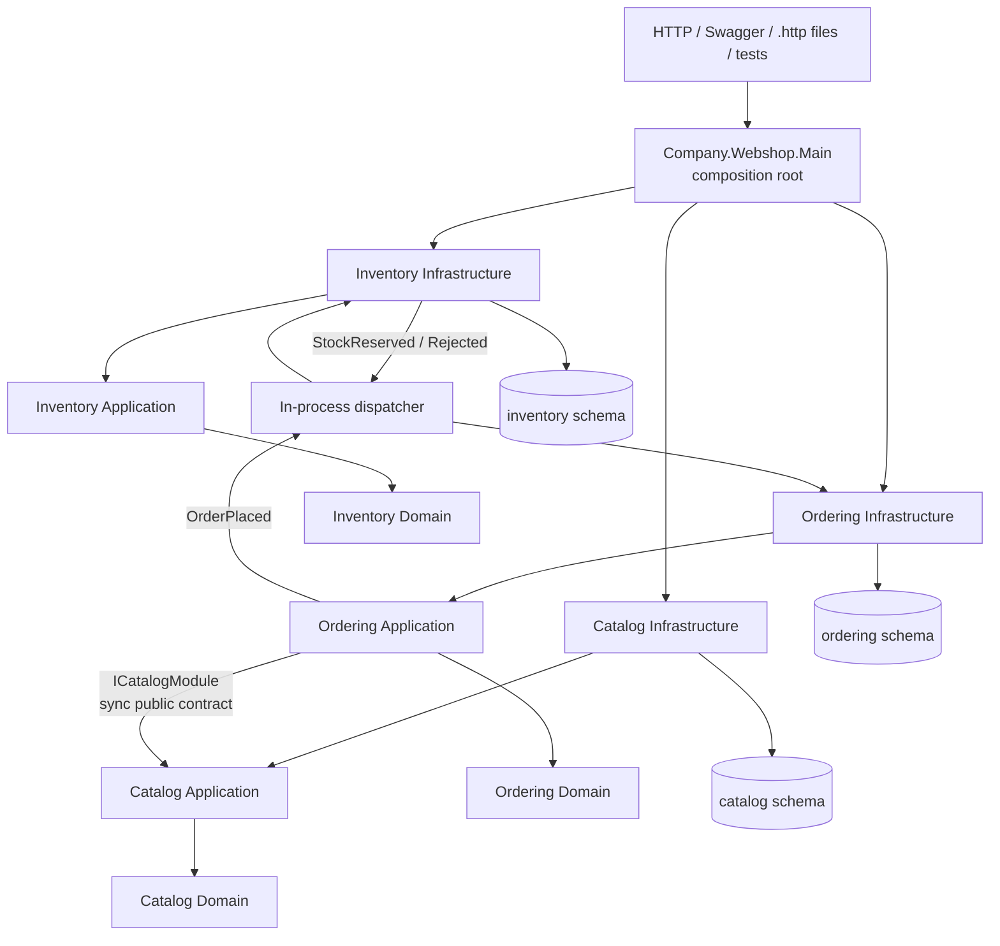
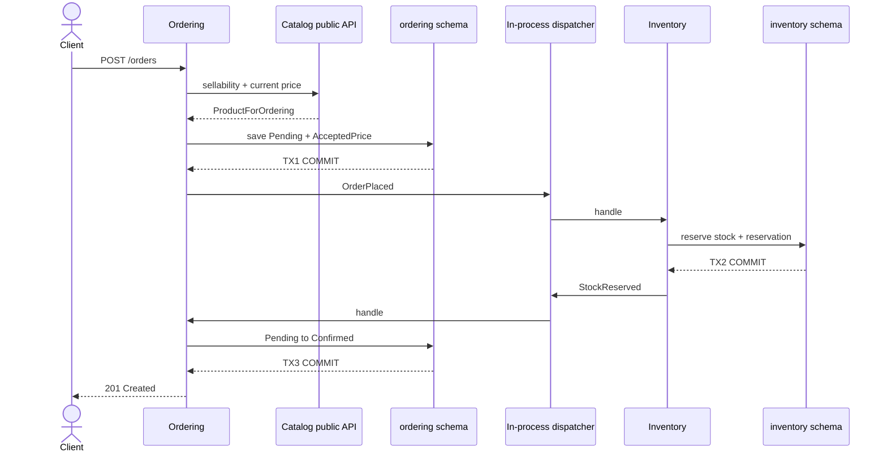
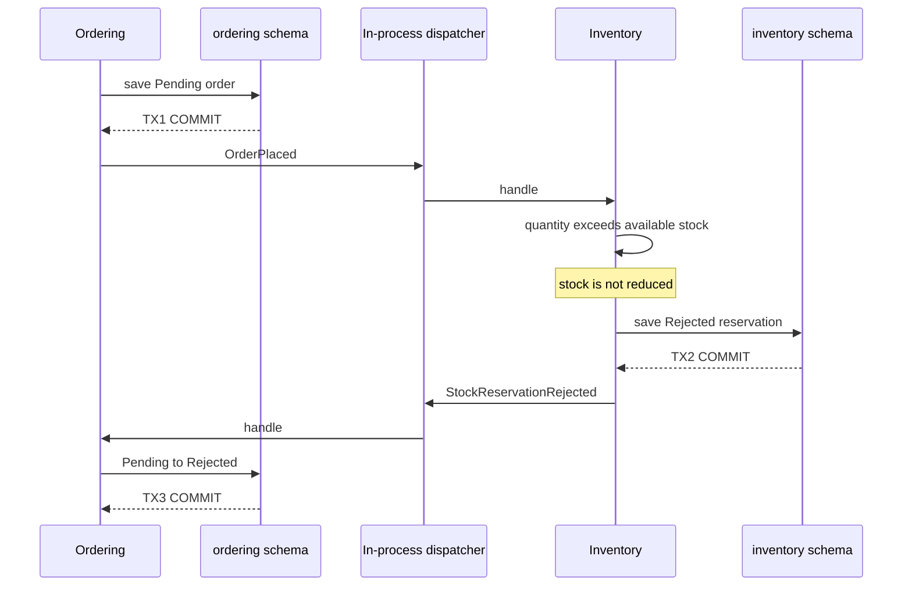
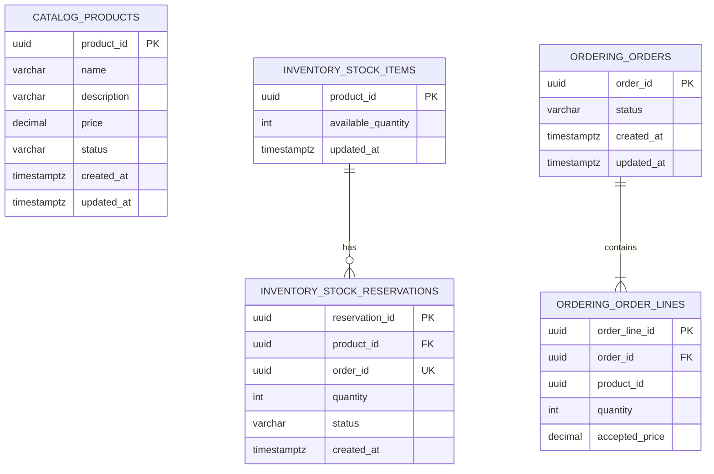

# C# Modular Monolith Webshop

A deliberately small .NET 10 webshop demonstrating strategic DDD boundaries, Ports and Adapters, PostgreSQL ownership, local transactions, and in-process integration events. It is one ASP.NET Core executable, one process, one deployment unit, and one physical database.

Read the [implementation guide](docs/team-project-guide.md) for concrete contract calls, event routing, schema/table mappings, migration ownership, and a complete order walkthrough with links to the code.

## Run and demonstrate

Prerequisites: .NET 10, Node.js 22.12+ (or 24+), and Docker. Start PostgreSQL, run the API, then execute `http-requests/demo-flow.http` in order or use the Vue frontend below.

```powershell
docker compose up -d postgres
dotnet run --project src/Company.Webshop.Main/Company.Webshop.Main.csproj
```

Swagger is at `http://localhost:5080/swagger`. The committed connection string targets the local Compose database; override `ConnectionStrings__Webshop` elsewhere.

```powershell
dotnet build Company.Webshop.slnx -m:1
dotnet test test/UnitTests/UnitTests.csproj -m:1
dotnet test test/IntegrationTest/IntegrationTest.csproj -m:1
```

`-m:1` avoids a project-graph restore race observed with the .NET 10 SDK on some Windows installations. Integration tests start an isolated real PostgreSQL 17 container and require Docker.

For the restart demo, complete the demo flow, stop the API with Ctrl+C, start it again without removing the Compose volume, and repeat the product, stock, and order GET requests. Products, stock, accepted prices, and order statuses reload from PostgreSQL.

## Module and dependency map



All modules and the dispatcher run inside one process. Cross-module references target only `Application.Contracts.Public`; aggregates, ports, repositories, domain events, and DbContexts are internal. Friend assembly access is restricted to the owning module's layers and tests. Architecture tests guard exported types, friend access, layer direction, and foreign implementation dependencies; persistence tests check schema-local tables and foreign keys in all command and query models. See [the boundary enforcement decision](docs/adr/0001-modular-monolith.md#boundary-enforcement).

Each module owns a command-side `DomainDbContext` and a read-side `QueryDbContext`, with PostgreSQL-specific context types under its infrastructure configuration. The command context owns migrations and aggregate persistence; query contexts expose schema-local read models only.

| Context | Responsibility | Public synchronous API | Events | Owned data |
|---|---|---|---|---|
| Catalog | Description, current price, publication, sellability | `ICatalogModule.GetProductForOrdering` | None | `catalog.products` |
| Inventory | Stock, replenishment, reservation decision/history | None | Consumes `OrderPlaced`; emits `StockReserved` or `StockReservationRejected` | `inventory.stock_items`, `inventory.stock_reservations` |
| Ordering | Order state, quantity, historic accepted price | HTTP use cases only | Emits `OrderPlaced`; consumes stock outcomes | `ordering.orders`, `ordering.order_lines` |

## Successful order sequence



## Insufficient-stock sequence



## Crow's Foot ERD



Only the two relationships drawn are SQL foreign keys. `ordering.order_lines.product_id`, `inventory.stock_items.product_id`, and `inventory.stock_reservations.order_id` are cross-context correlation values, deliberately not foreign keys.

## Architecture decision and coupling

The bounded context is the primary unit; Domain, Application, and Infrastructure are separate projects within it. This provides compile-time layer direction while keeping business language cohesive. Main is the sole composition root. Every bounded context owns its DDD base types, repository abstraction, use-case contract, unit of work, and domain-event contracts. Shared contains only technical exception and in-process integration-event support. NetArchTest rules prohibit Domain/Infrastructure/Main leakage and cross-module implementation references; a test-only bad dependency proves the rules detect a violation.

Ordering synchronously depends on Catalog's narrow public contract because sellability and price are needed before an order can exist. Reservation is event-driven because it is a separate consistency boundary. Inventory consumes only Ordering's public event contract, while Ordering consumes only Inventory's public outcome contracts. There are no cross-module repositories, navigations, queries, joins, or business foreign keys.

## Transactions, consistency, and failure semantics

There is no global transaction. TX1 commits the Pending order before `OrderPlaced`; TX2 commits Inventory's reservation decision before its outcome event; TX3 commits Ordering's final state. Dispatch is awaited and normally completes before the HTTP response, although the boundaries permit a Pending state between commits.

The dispatcher is intentionally non-durable. If Ordering commits Pending and dispatch or an Inventory handler fails, the order can remain Pending. If Inventory commits and the Ordering outcome handler fails, stock and reservation history may be committed while the order remains Pending. Cancellation or process termination creates the same risk. A production design should add a transactional outbox per module, retries, idempotent consumers, a durable broker where appropriate, monitoring, and reconciliation/recovery.

## Limitations

- No authentication, customers, payment, shipping, discounts, or cloud deployment.
- Startup applies the reviewed migration set owned by each module; every schema has its own EF migration-history table.
- The process-local dispatcher has no durable retry queue.
- Reservation idempotency is keyed by `order_id`; concurrent stock updates need an explicit concurrency policy at production load.
- The workflow accepts one order line to keep the architecture demonstration focused; the aggregate and schema can be extended later.

`config/asyncapi.yaml` documents the actual contracts without implying AMQP. The `.http` files are repeatable manual demo assets; automated behavior lives in unit, architecture, persistence, and workflow tests.

## Vue frontend

See [frontend/README.md](frontend/README.md) for development, production publishing, API constraints, and the complete UI demonstration. Production publishes Vue assets into the ASP.NET Core application's wwwroot as one deployment unit.

