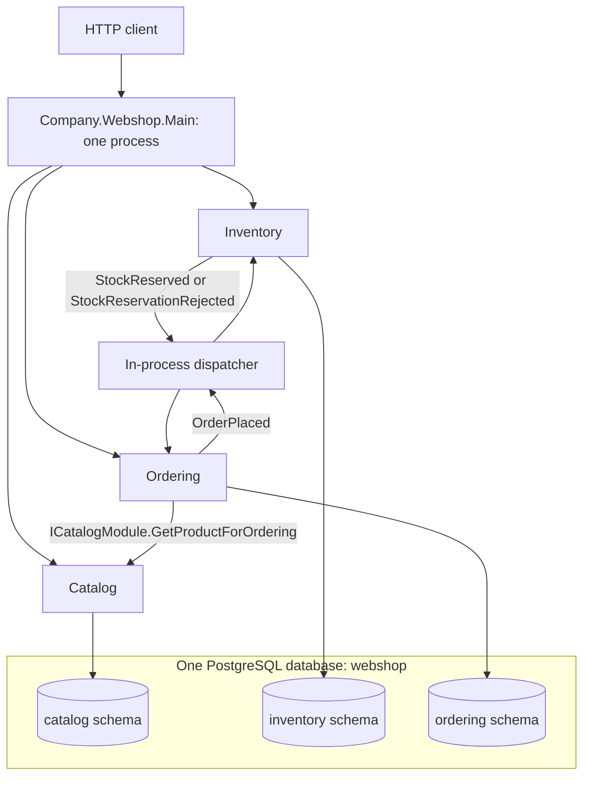
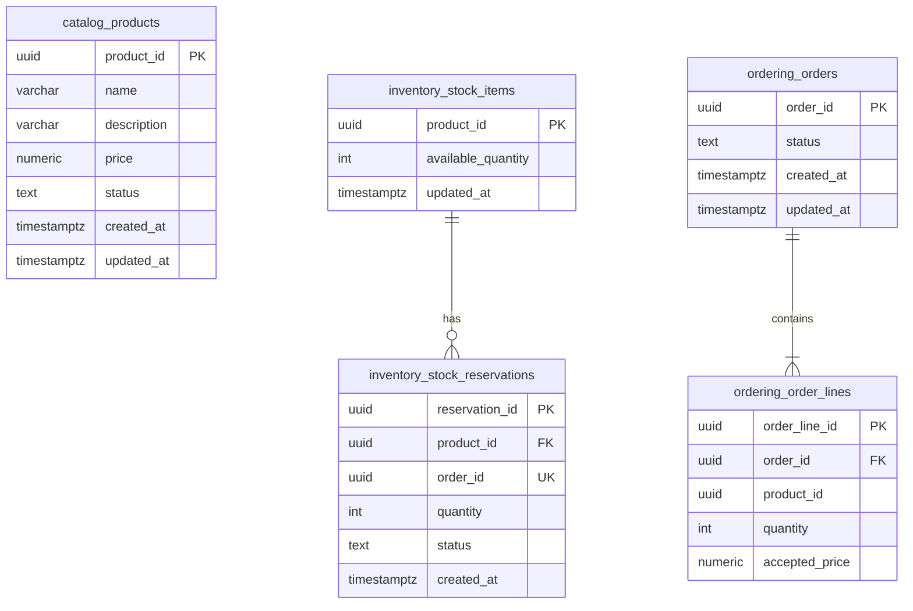
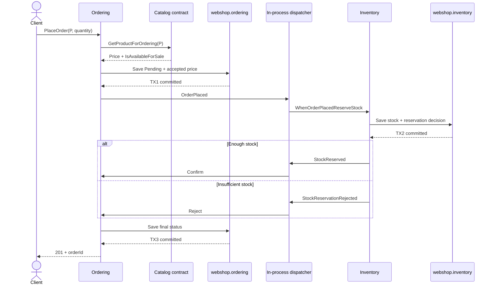

# Modular Monolith Webshop — implementation guide

This guide describes the code in `C:\Users\Cristian\Desktop\project-dotnet`, rather than a proposed architecture. Start with the database map below, then follow one order through the contracts and commits. Source links point to the actual implementation.

## 1. What we run

There is one executable: `Company.Webshop.Main`. Catalog, Inventory, and Ordering are class libraries loaded into that ASP.NET Core process. We start one API and one PostgreSQL service; there is no HTTP call between modules and no message broker.

The root [docker-compose.yml](../docker-compose.yml) sets `POSTGRES_DB: webshop`. [appsettings.json](../src/Company.Webshop.Main/appsettings.json) supplies this single connection:

```text
Host=localhost;Port=5432;Database=webshop;Username=postgres;Password=postgres
```

All three `Add...Module` methods configure their contexts through a private `GetConnection` helper, which resolves `IConfiguration` and reads `GetConnectionString("Webshop")` when the context is created. Changing `ConnectionStrings__Webshop` changes the database used by every module's command and query context. Different schemas do not mean different databases, servers, or deployment units.



## 2. Exactly how the database is split

A PostgreSQL schema is a namespace inside a database. `catalog.products` means table `products` in schema `catalog`, inside database `webshop`. It is not another database named `catalog`.

```text
PostgreSQL server
└── webshop                          ONE database
    ├── catalog                      Catalog owns this schema
    │   ├── products
    │   └── __EFMigrationsHistory
    ├── inventory                    Inventory owns this schema
    │   ├── stock_items
    │   ├── stock_reservations
    │   └── __EFMigrationsHistory
    └── ordering                     Ordering owns this schema
        ├── orders
        ├── order_lines
        └── __EFMigrationsHistory
```

| Table | Actual columns | Owner and purpose |
|---|---|---|
| `catalog.products` | `product_id` PK, `name`, `description`, `price`, `status`, `created_at`, `updated_at` | Catalog owns current product information, current price, and publication state. |
| `inventory.stock_items` | `product_id` PK, `available_quantity`, `updated_at` | Inventory owns the available stock count for a product ID. |
| `inventory.stock_reservations` | `reservation_id` PK, `product_id` FK, `order_id` unique, `quantity`, `status`, `created_at` | Inventory records a Reserved or Rejected decision for an order. |
| `ordering.orders` | `order_id` PK, `status`, `created_at`, `updated_at` | Ordering owns Pending, Confirmed, or Rejected state. |
| `ordering.order_lines` | `order_line_id` PK, `order_id` FK, `product_id`, `quantity`, `accepted_price` | Ordering owns the requested quantity and historical accepted price. |

Prices use `numeric(18,2)`, identifiers use PostgreSQL `uuid`, timestamps use `timestamp with time zone`, and quantities use integers. Status values are stored as strings. Read the actual definitions in [InitialCatalog](../src/Modules/Catalog/Company.Catalog.Infrastructure/Persistence/EntityFramework/Migrations/InitialCatalog.cs), [InitialInventory](../src/Modules/Inventory/Company.Inventory.Infrastructure/Persistence/EntityFramework/Migrations/InitialInventory.cs), and [InitialOrdering](../src/Modules/Ordering/Company.Ordering.Infrastructure/Persistence/EntityFramework/Migrations/InitialOrdering.cs).

### Where the schema is selected in C#

[CatalogDbContext.cs](../src/Modules/Catalog/Company.Catalog.Infrastructure/Persistence/EntityFramework/Configuration/CatalogDbContext.cs) contains:

```csharp
modelBuilder.HasDefaultSchema("catalog");
```

Its Product mapping calls `b.ToTable("products")`, so EF writes to `catalog.products`. The corresponding [InventoryDbContext](../src/Modules/Inventory/Company.Inventory.Infrastructure/Persistence/EntityFramework/Configuration/InventoryDbContext.cs) selects `inventory`; [OrderingDbContext](../src/Modules/Ordering/Company.Ordering.Infrastructure/Persistence/EntityFramework/Configuration/OrderingDbContext.cs) selects `ordering`.

The query mappings explicitly name both table and schema. For example, [Catalog DbContexts.cs](../src/Modules/Catalog/Company.Catalog.Infrastructure/Persistence/EntityFramework/Configuration/DbContexts.cs) contains:

```csharp
builder.ToTable("products", "catalog");
```

This mapping is why a Catalog query stays within Catalog's tables. The connection string selects the database; EF mappings select the schema and table inside it.

### Two real foreign keys, no foreign keys across modules



The diagram uses underscores in entity labels; the real SQL names use dots, such as `inventory.stock_items`.

`inventory.stock_reservations.product_id` references `inventory.stock_items.product_id` with restricted deletion. `ordering.order_lines.order_id` references `ordering.orders.order_id` with cascading deletion. Those are relationships inside the owning module.

`ordering.order_lines.product_id` does **not** reference `catalog.products` with a SQL FK. `inventory.stock_reservations.order_id` does **not** reference `ordering.orders` with a SQL FK. They contain copied Guid values used for correlation. There is no `OrderLine.Product` or `StockReservation.Order` EF navigation to another module's aggregate.

For example, an OrderLine stores product ID P, quantity 4, and accepted price 19.99. Loading that order does not join Catalog to obtain today's price. It reads Ordering's own `order_lines` row.

### Ownership enforcement and its exact limit

Module internals and architecture tests prevent normal C# callers from taking another module's DbContext or repository. EF model tests check schema-local mappings and foreign keys. The application does not query another module's schema directly.

The development configuration uses the same PostgreSQL user for all modules. PostgreSQL itself therefore does not prohibit that user from issuing arbitrary cross-schema SQL. This implementation enforces ownership in code, visibility, model checks, and review. Separate database roles and grants would add database-level enforcement; they are not currently configured. A future raw SQL change still needs review.

## 3. Six DbContexts still use one database

| Module | Command context | Query context | Tables read by the query context |
|---|---|---|---|
| Catalog | `CatalogDbContext` | `PostgresCatalogQueryDbContext` | `catalog.products` |
| Inventory | `InventoryDbContext` | `PostgresInventoryQueryDbContext` | `inventory.stock_items` |
| Ordering | `OrderingDbContext` | `PostgresOrderingQueryDbContext` | `ordering.orders`, `ordering.order_lines` |

The command inheritance chain is, for example, `CatalogDbContext -> PostgresCatalogDomainDbContext -> DomainDbContext -> DbContext`. Catalog's local `DomainDbContext` implements Catalog's `IUnitOfWork`. Inventory and Ordering have their own types and their own registrations.

Command contexts materialize aggregates and track changes. Query contexts map internal read models such as `CatalogProductData` and `OrderLineData`. They read the same committed tables, not replicas, extra databases, or asynchronously updated projections. Only the command context owns migrations.

The concrete HTTP read paths are:

```text
GET /catalog/products/{id}
  -> FindProductById -> IQuery<FindProductByIdInput, ProductDetails?>
  -> FindProductQuery -> PostgresCatalogQueryDbContext -> catalog.products

GET /inventory/products/{id}
  -> FindStockByProductId -> IQuery<FindStockByProductIdInput, StockDetails?>
  -> FindStockQuery -> PostgresInventoryQueryDbContext -> inventory.stock_items

GET /orders/{id}
  -> FindOrderById -> IQuery<FindOrderByIdInput, OrderDetails?>
  -> FindOrderQuery -> PostgresOrderingQueryDbContext
  -> ordering.orders + ordering.order_lines
```

[FindOrderQuery.cs](../src/Modules/Ordering/Company.Ordering.Infrastructure/Persistence/EntityFramework/Queries/FindOrderQuery.cs) projects the stored lines and accepted prices into `OrderDetails`. Its correlation between orders and lines stays inside `ordering`. [FindProductQuery](../src/Modules/Catalog/Company.Catalog.Infrastructure/Persistence/EntityFramework/Queries/FindProductQuery.cs) and [FindStockQuery](../src/Modules/Inventory/Company.Inventory.Infrastructure/Persistence/EntityFramework/Queries/FindStockQuery.cs) follow the same pattern. All these adapters use `AsNoTracking()`.

The synchronous Catalog contract has a different purpose: it loads Catalog's Product through Catalog's repository to evaluate `Product.IsAvailableForSale`. Ordering receives the answer, never the aggregate. The sellability rule remains in Catalog's domain.

## 4. Migrations and startup: who creates what?

[CatalogModule.cs](../src/Modules/Catalog/Company.Catalog.Infrastructure/CatalogModule.cs) registers the command context like this:

```csharp
services.AddDbContext<CatalogDbContext>((sp, o) => o.UseNpgsql(GetConnection(sp),
        npgsql => npgsql.MigrationsHistoryTable("__EFMigrationsHistory", "catalog"))
    .AddInterceptors(sp.GetRequiredService<PublishDomainEventsInterceptor>()));
```

Inventory passes `"inventory"` and Ordering passes `"ordering"` to `MigrationsHistoryTable`. Each module tracks its own migration set inside its own schema.

Each module's private helper is:

```csharp
private static string GetConnection(IServiceProvider services)
    => services.GetRequiredService<IConfiguration>().GetConnectionString("Webshop")
        ?? throw new InvalidOperationException("ConnectionStrings:Webshop is required.");
```

Resolving configuration when a DbContext is created also allows the integration-test host to supply its container's connection before the context opens a connection. Capturing the development connection string early during module registration would defeat that test override.

[Program.cs](../src/Company.Webshop.Main/Program.cs) calls `await app.Services.InitializeModuleDatabases()` before serving requests. [Modules.cs](../src/Company.Webshop.Main/Modules/Modules.cs) then calls:

```csharp
await services.InitializeCatalogDatabase(cancellationToken);
await services.InitializeInventoryDatabase(cancellationToken);
await services.InitializeOrderingDatabase(cancellationToken);
```

Each method creates a DI scope, resolves its own command context, and runs `Database.MigrateAsync`. The initial migration uses `EnsureSchema` and creates only its own tables. Startup does not create three physical databases, drop tables, or reseed stock. The Compose named volume `webshop-postgres` retains the database when the application process stops.

## 5. Three different meanings of “contract” in this code

| Contract kind | Actual example | Who can use it? | What it exposes |
|---|---|---|---|
| Public synchronous module API | `ICatalogModule` and `ProductForOrdering` | Ordering's Application layer | Current price and Catalog's sellability decision |
| Public integration event | `OrderPlaced`, `StockReserved`, `StockReservationRejected` | Other modules' event adapters | A committed fact represented by IDs and values |
| Internal port | `IUseCase`, `IQuery`, `IUnitOfWork`, `IProductRepository` | The owning module's layers and tests | A local abstraction implemented inside that module |

The word `Contracts` in a directory name does not make every interface public. `Application/Contracts/Ports` is internal. Only `Application/Contracts/Public` contains the public cross-module API. Repository interfaces live in Domain, next to the aggregate, and are also internal.

### The exact Catalog contract

[ICatalogModule.cs](../src/Modules/Catalog/Company.Catalog.Application/Contracts/Public/ICatalogModule.cs):

```csharp
public interface ICatalogModule
{
    Task<ProductForOrdering?> GetProductForOrdering(Guid productId, CancellationToken cancellationToken = default);
}

public sealed record ProductForOrdering(Guid ProductId, decimal Price, bool IsAvailableForSale);
```

If P is Published with a price of 19.99, Catalog returns `new ProductForOrdering(P, 19.99m, true)`. An unknown product returns null. Draft and Discontinued products return a DTO whose `IsAvailableForSale` is false. Ordering rejects all three unavailable cases before adding an order.

`ProductForOrdering` deliberately contains no Product aggregate, EF entity, repository, or DbContext. Its Guid and decimal are independent of Catalog's internal `ProductId` and `Price` classes. Ordering wraps the decimal in its own `AcceptedPrice` value object.

### How dependency injection connects the call

Catalog registers:

```csharp
services.AddScoped<ICatalogModule>(sp => sp.GetRequiredService<CatalogService>());
```

[OrderingApplication.cs](../src/Modules/Ordering/Company.Ordering.Application/OrderingApplication.cs) asks for `ICatalogModule` in `OrderingService`'s constructor. ASP.NET Core DI supplies Catalog's implementation. The call is an ordinary awaited C# method call in the same process. “Synchronous collaboration” here means Ordering waits for the answer before deciding; it does not mean blocking a thread with `.Result`.

The method body in [CatalogApplication.cs](../src/Modules/Catalog/Company.Catalog.Application/CatalogApplication.cs) is:

```csharp
Product? product = await products.Get(ProductId.From(productId), cancellationToken);
return product is null ? null : new(product.Id.Value, product.CurrentPrice.Amount, product.IsAvailableForSale);
```

[Product.cs](../src/Modules/Catalog/Company.Catalog.Domain/Products/Product.cs) defines `IsAvailableForSale => Status == ProductStatus.Published`. `Publish` requires a positive price; changing a Published product's price also checks positivity. Ordering does not inspect ProductStatus or reproduce those rules.

## 6. Public event contracts and their owners

[OrderPlaced.cs](../src/Modules/Ordering/Company.Ordering.Application/Contracts/Public/OrderPlaced.cs) belongs to Ordering:

```csharp
public sealed record OrderPlaced(Guid OrderId, Guid ProductId, int Quantity) : IIntegrationEvent;
```

[StockEvents.cs](../src/Modules/Inventory/Company.Inventory.Application/Contracts/Public/StockEvents.cs) belongs to Inventory:

```csharp
public sealed record StockReserved(Guid OrderId, Guid ProductId, int Quantity) : IIntegrationEvent;
public sealed record StockReservationRejected(Guid OrderId, Guid ProductId, int Quantity, string Reason) : IIntegrationEvent;
```

For order O1 requesting four units of P, Ordering publishes `new OrderPlaced(O1, P, 4)`. Inventory replies with `new StockReserved(O1, P, 4)` after saving the reservation. If stock is insufficient, it publishes `new StockReservationRejected(O1, P, 4, "Insufficient stock.")` after saving the rejected decision.

The event contracts are in their publisher's Application assembly, not in Shared. Shared contains only the technical `IIntegrationEvent` marker, handler/dispatcher interfaces, dispatcher implementation, registration helper, and `BusinessRuleException`. There is no shared Product or Order model.

### How the dispatcher finds the handler

[InventoryModule.cs](../src/Modules/Inventory/Company.Inventory.Infrastructure/InventoryModule.cs) registers:

```csharp
services.AddScoped<IIntegrationEventHandler<OrderPlaced>, WhenOrderPlacedReserveStock>();
```

[OrderingModule.cs](../src/Modules/Ordering/Company.Ordering.Infrastructure/OrderingModule.cs) registers:

```csharp
services.AddScoped<IIntegrationEventHandler<StockReserved>, WhenStockReservedConfirmOrder>();
services.AddScoped<IIntegrationEventHandler<StockReservationRejected>, WhenStockReservationRejectedRejectOrder>();
```

[IntegrationEvents.cs](../src/Company.Webshop.Shared/IntegrationEvents/IntegrationEvents.cs) contains the dispatch mechanism:

```csharp
await using AsyncServiceScope scope = scopeFactory.CreateAsyncScope();
IEnumerable<IIntegrationEventHandler<TEvent>> handlers =
    scope.ServiceProvider.GetServices<IIntegrationEventHandler<TEvent>>();

foreach (IIntegrationEventHandler<TEvent> handler in handlers)
{
    await handler.Handle(integrationEvent, cancellationToken);
}
```

Publishing `OrderPlaced` resolves handlers for that exact event type. Publishing `StockReserved` creates another scope and resolves the corresponding Ordering handler. The fresh scopes give each dispatch its own scoped services and DbContexts; they do not reuse the original request's tracked Order.

Handlers are awaited. In the normal successful flow the order reaches its final state before POST /orders returns. There is no background queue, serializer, network transport, retry loop, or durable event table. [asyncapi.yaml](../config/asyncapi.yaml) documents the payloads; it does not configure a broker.

## 7. Follow a real order through three local transactions

Setup: product P is Published at 19.99; `inventory.stock_items` contains P with available quantity 10. The client sends:

```http
POST /orders
Content-Type: application/json

{"productId":"<P>","quantity":4}
```

`<P>` represents the actual Guid returned by product creation; substitute it before sending.

### TX1: Ordering stores Pending and the accepted price

The endpoint in `OrderingModule.MapOrderingEndpoints` constructs `PlaceOrderInput` and calls `PlaceOrder.Execute`. That delegates to `OrderingService.Place`:

```csharp
if (quantity <= 0) throw new BusinessRuleException("Order quantity must be positive.");
ProductForOrdering? product = await catalog.GetProductForOrdering(productId, ct);
if (product is null || !product.IsAvailableForSale)
    throw new BusinessRuleException("Product is not available for sale.");
Order order = Order.Place(OrderId.New(), productId, Quantity.From(quantity), AcceptedPrice.From(product.Price), DateTimeOffset.UtcNow);
await orders.Add(order, ct);
await unitOfWork.Do(ct); // Ordering transaction commits before dispatch starts.
await events.Publish(new OrderPlaced(order.Id.Value, productId, quantity), ct);
```

`EfCoreOrderRepository.Add` adds the aggregate to OrderingDbContext. `IUnitOfWork.Do` calls that context's `SaveChangesAsync`; EF persists the order and its line atomically. Only after this returns does the integration event leave Ordering.

At this point the database has O1 Pending, one line for P with quantity 4 and accepted_price 19.99, and stock is still 10.

### TX2: Inventory owns the reservation decision

`WhenOrderPlacedReserveStock.Handle` calls `InventoryService.Reserve`. That method checks whether this order already has a reservation, loads or creates the StockItem, calls `TryReserve`, adds a StockReservation, and commits through Inventory's own unit of work.

The business decision is in [StockItem.cs](../src/Modules/Inventory/Company.Inventory.Domain/Stock/StockItem.cs): if available quantity is below the request, `TryReserve` returns false without subtracting. Otherwise it subtracts the requested quantity.

For O1, available quantity changes from 10 to 6 and a Reserved row is inserted for O1, P, quantity 4. Both changes are saved by InventoryDbContext in one local SaveChanges transaction. The handler then publishes StockReserved.

### TX3: Ordering owns the final order state

`WhenStockReservedConfirmOrder` calls `OrderingService.Confirm`. It loads O1 using a new OrderingDbContext, calls `Order.Confirm`, and commits. [Order.cs](../src/Modules/Ordering/Company.Ordering.Domain/Orders/Order.cs) permits this only while Pending. A Confirmed order cannot later become Rejected.

| After step | Ordering row | Inventory stock | Inventory reservation |
|---|---|---|---|
| Before order | No O1 | 10 | None |
| TX1 commit | O1 Pending; price 19.99 | 10 | None |
| TX2 commit | O1 Pending; price 19.99 | 6 | O1 Reserved, quantity 4 |
| TX3 commit | O1 Confirmed; price 19.99 | 6 | O1 Reserved, quantity 4 |

### Second order: insufficient stock

Now request 20 units of P. Catalog still permits the sale, so O2 is saved Pending with accepted price 19.99. Inventory sees only 6 available, leaves stock at 6, and inserts a Rejected reservation for quantity 20. It commits and publishes StockReservationRejected. Ordering changes O2 from Pending to Rejected and commits.

POST /orders returns 201 with an order ID for this business outcome because an order was created. GET /orders/{O2} reports Rejected. An unknown, Draft, or Discontinued product is different: Ordering returns a business validation error before any order is created.



There is no TransactionScope or unit of work spanning these modules. Sharing a physical database does not make TX1, TX2, and TX3 a single transaction.

## 8. Why historical prices do not change

Catalog's `Product.ChangePrice` can change its current price from 19.99 to 24.99. O1's `ordering.order_lines.accepted_price` remains 19.99 because Ordering copied the accepted value when creating the order. GET /orders reads Ordering's stored price, without asking Catalog again.

[ModuleOwnershipTests.AcceptedPriceAndStockSurviveNewHostAfterCatalogPriceChanges](../test/IntegrationTest/Workflows/ModuleOwnershipTests.cs) exercises exactly this sequence. It changes the Catalog aggregate through test-only internal access, creates a new application host against the same PostgreSQL database, and checks Catalog's 24.99, the old order's 19.99, its Confirmed state, and stock 6. It then places a rejected order at the new price and checks that stock remains 6. There is currently no public HTTP endpoint for changing price; the domain method exists and this test calls it within Catalog's persistence scope.

## 9. Local ports, repositories, and domain events

Catalog's [IProductRepository](../src/Modules/Catalog/Company.Catalog.Domain/Products/IProductRepository.cs) exposes local aggregate persistence. [Repositories.cs](../src/Modules/Catalog/Company.Catalog.Infrastructure/Persistence/EntityFramework/Repositories/Repositories.cs) implements it with `db.Products.AddAsync` and `SingleOrDefaultAsync`. Catalog's registration connects `IProductRepository` to `EfCoreProductRepository` and `IUnitOfWork` to `CatalogDbContext`. Inventory and Ordering make equivalent registrations with their own types.

There is no global repository or UoW that can save Product, StockItem, and Order together. The command DbContext is the EF unit-of-work adapter itself; there is no separate class named EfCoreUnitOfWork or unused generic EF repository base.

ProductRegistered and ProductPublished are internal Catalog domain events. OrderCreated, OrderConfirmed, and OrderRejected are internal Ordering domain events. The aggregate records them in `DomainEvents`. The module's `PublishDomainEventsInterceptor.SavedChangesAsync` publishes them to local `IDomainEventListener<T>` services after successful SaveChanges, then clears the collection. No domain listeners are currently registered. Inventory has the same local domain-event infrastructure, but its current StockItem behavior does not raise domain events.

These domain events are not the integration events. `OrderingService.Place` explicitly publishes OrderPlaced after committing. The Inventory adapter explicitly publishes StockReserved or StockReservationRejected after committing. An internal OrderCreated event is never sent directly to Inventory.

All modules keep their own `Domain/Shared` base types: Entity, AggregateRoot, ValueObject, IDs, assertions, and domain-event interfaces. For example, Catalog's Price and Ordering's AcceptedPrice are separate classes because they represent different business facts.

## 10. What prevents another module from bypassing a contract?

Domain classes, repository interfaces, use-case classes, query ports, and DbContexts are `internal`. The Domain project grants friend access to its own Application and Infrastructure plus tests. Application grants friend access to its own Infrastructure and UnitTests. Infrastructure grants friend access only to tests. Main is not a friend assembly.

The public module surface consists of Application's `Contracts.Public` types plus each Infrastructure module's composition entry point. For example, [Company.Catalog.Domain.csproj](../src/Modules/Catalog/Company.Catalog.Domain/Company.Catalog.Domain.csproj) grants access to `Company.Catalog.Application` and `Company.Catalog.Infrastructure`, not to `Company.Ordering.Application`.

This code in Ordering would fail to compile:

```csharp
// Forbidden example; do not add this to production code.
Company.Catalog.Domain.Products.Product product;
```

This is the permitted collaboration already in Ordering:

```csharp
ProductForOrdering? product = await catalog.GetProductForOrdering(productId, ct);
```

Contracts currently live in their module's Application assembly, rather than separate Contracts projects. Cross-module project references therefore point to Application assemblies, but implementation types are hidden. [ModuleBoundaryTests](../test/UnitTests/Architecture/ModuleBoundaryTests.cs) prevents accidentally exporting them or granting a foreign module friend access.

The dependency tests also check inward layer direction, forbidden foreign implementation dependencies, and that Shared has no dependency on any business module or Main. [ArchitectureTests](../test/UnitTests/Architecture/ArchitectureTests.cs) includes a deliberately forbidden test-only dependency and asserts that the checker detects it. [PersistenceModelTests](../test/UnitTests/Architecture/PersistenceModelTests.cs) checks all six contexts for owned schemas and local foreign keys.

## 11. HTTP requests, errors, and the composition root

[Modules.cs](../src/Company.Webshop.Main/Modules/Modules.cs) registers Catalog, Inventory, Ordering, the in-process dispatcher, and the web API exception handler. It maps all three modules' endpoints. Business decisions remain in module services and aggregates.

| Request | Use case | Normal response |
|---|---|---|
| POST `/catalog/products` | RegisterProduct | 201, productId; starts Draft |
| POST `/catalog/products/{id}/publish` | PublishProduct | 204 |
| POST `/catalog/products/{id}/discontinue` | DiscontinueProduct | 204 |
| GET `/catalog/products/{id}` | FindProductById | Product details or 404 |
| POST `/inventory/products/{id}/replenish` | ReplenishStock | 204 |
| GET `/inventory/products/{id}` | FindStockByProductId | Stock details or 404 |
| POST `/orders` | PlaceOrder | 201, orderId |
| GET `/orders/{id}` | FindOrderById | Status and stored lines or 404 |

The web adapters are minimal API route handlers in the module files; this implementation does not use MVC controller classes. They construct inputs, invoke use cases, and map responses. [GlobalExceptionHandler](../src/Company.Webshop.Main/Modules/WebApi/WebApiModule.cs) maps BusinessRuleException to HTTP 400 and KeyNotFoundException to HTTP 404. Unhandled infrastructure errors remain server errors.

Publication requires a positive price. A Draft may carry an unresolved/nonpositive price until publication. Replenishment and order quantities must be positive. Inventory replenishment currently validates its product ID and quantity without querying Catalog; it can create a stock record for any nonempty product Guid. Ordering still checks Catalog before creating an order.

## 12. Inspect the single database yourself

From the repository root:

```powershell
docker compose up -d postgres
dotnet run --project src/Company.Webshop.Main/Company.Webshop.Main.csproj
```

In another terminal:

```powershell
docker compose exec postgres psql -U postgres -d webshop
```

Inside psql, run these read-only inspection commands:

```sql
SELECT current_database();

SELECT table_schema, table_name
FROM information_schema.tables
WHERE table_schema IN ('catalog', 'inventory', 'ordering')
ORDER BY table_schema, table_name;

SELECT * FROM catalog.products;
SELECT * FROM inventory.stock_items;
SELECT * FROM inventory.stock_reservations;
SELECT * FROM ordering.orders;
SELECT * FROM ordering.order_lines;

SELECT * FROM catalog."__EFMigrationsHistory";
SELECT * FROM inventory."__EFMigrationsHistory";
SELECT * FROM ordering."__EFMigrationsHistory";
```

The first result is `webshop`. The table query should show five business tables and three migration-history tables. These are administrator/demo inspection queries, not permission for a business module to read foreign tables.

To inspect actual database foreign keys:

```sql
SELECT ns.nspname AS schema_name, tbl.relname AS table_name,
       pg_get_constraintdef(con.oid) AS definition
FROM pg_constraint con
JOIN pg_class tbl ON tbl.oid = con.conrelid
JOIN pg_namespace ns ON ns.oid = tbl.relnamespace
WHERE con.contype = 'f'
  AND ns.nspname IN ('catalog', 'inventory', 'ordering');
```

Expect only the stock-reservation-to-stock-item and order-line-to-order relationships.

## 13. Run and explain the live demo

Use [demo-flow.http](../http-requests/demo-flow.http) in order: create and publish a product, replenish 10, place an order for 4, read Confirmed and stock 6, place an order for 20, read Rejected and stock still 6. Keep the generated IDs when switching to GET requests.

Stop only the API process and start it again. Repeat the GET requests using the same IDs. PostgreSQL and its named volume retain products, reservations, orders, and accepted prices. Do not run `docker compose down -v` during the persistence demo: that removes the database volume.

Swagger is available at `http://localhost:5080/swagger` in Development. [webapi.yaml](../config/webapi.yaml) documents HTTP routes; [asyncapi.yaml](../config/asyncapi.yaml) documents event contracts. Happy/unhappy request files are under `http-requests/`.

## 14. Tests and what they prove

```powershell
dotnet build Company.Webshop.slnx -m:1
dotnet test test/UnitTests/UnitTests.csproj -m:1
dotnet test test/IntegrationTest/IntegrationTest.csproj -m:1
```

| Test group | Concrete evidence |
|---|---|
| Catalog domain tests | Publication validates price; Draft/Discontinued cannot be sold. |
| Inventory domain tests | Positive quantities; reserve subtracts stock; rejection leaves it unchanged. |
| Ordering domain tests | Pending initialization, accepted price, allowed transitions, final-state protection. |
| Application tests | Use cases invoke local repositories/UoW and publish integration contracts. |
| Architecture tests | Module internals, public surfaces, friends, layer direction, forbidden dependencies. |
| PersistenceModelTests | Mappings, migrations, owned schemas, schema-local FKs in command/query models. |
| PostgreSQL workflow tests | HTTP -> modules -> real EF/PostgreSQL -> confirmed/rejected order and stock. |
| ModuleOwnershipTests | All six contexts use one test database; each module owns a migration-history table; a fresh host reloads data and preserves old accepted prices after Catalog changes. |

Integration tests start an isolated PostgreSQL 17 container. [WebshopApiFactory](../test/IntegrationTest/Shared/WebshopApiFactory.cs) overrides `ConnectionStrings:Webshop` for the whole host; it retains production module registrations, interceptors, schema mappings, and migration-history settings. It does not substitute an in-memory EF provider. Tests require a running Docker engine and permission to access its pipe/socket.

Verified on 2 October 2026: the full solution builds, all 56 unit/architecture tests pass, and all 10 PostgreSQL integration tests pass. The build reported NU1900 warnings because the NuGet vulnerability feed was unreachable; compilation and test execution succeeded. The fresh-host persistence check is automated; the manual stop/start demo above remains a procedure the team can repeat during presentation.

## 15. Known limits: describe the implementation honestly

If TX1 commits but event delivery fails, an order can remain Pending. If TX2 commits but the outcome handler fails, stock can be reserved while the order remains Pending. Earlier commits do not roll back because a later handler throws. The HTTP request may fail even though an order row was already committed.

Inventory checks for an existing reservation by order ID and has a unique index on that column. This prevents normal sequential duplicate reservation processing; a duplicate is ignored. It does not replay a lost outcome event, make Ordering's final-state handlers idempotent, or provide complete concurrent-delivery recovery. Concurrent stock updates also still need an explicit concurrency policy before production load.

Transactional outboxes, durable retries, idempotent outcome handling, monitoring, and reconciliation are possible production additions. They are not implemented here. No external broker is required for the assignment's in-process minimum.

The API accepts one product line per order. Authentication, payments, shipping, customers, discounts, and a frontend are outside this implementation. Query/command separation is local code organization over the same tables. Separate schemas and C# visibility do not provide a security boundary against malicious reflection or unrestricted database credentials.

## 16. Team ownership tied to code

| Responsibility | Files to explain during the demonstration |
|---|---|
| Catalog | Product.cs; CatalogApplication.cs; ICatalogModule.cs; CatalogDbContext.cs; FindProductQuery.cs; InitialCatalog.cs |
| Inventory | StockItem.cs; InventoryApplication.cs; StockEvents.cs; InventoryModule's OrderPlaced handler; InventoryDbContext.cs; InitialInventory.cs |
| Ordering | Order.cs; OrderingApplication.cs; OrderPlaced.cs; OrderingModule's stock-outcome handlers; OrderingDbContext.cs; FindOrderQuery.cs; InitialOrdering.cs |
| Shared integration work | Main/Modules/Modules.cs; Shared/IntegrationEvents/IntegrationEvents.cs; architecture tests; PostgreSQL fixture; this guide |

For the oral explanation, point to `GetConnectionString("Webshop")` to prove one database, `HasDefaultSchema` and `ToTable` to prove schema ownership, `ICatalogModule` to show synchronous collaboration, the three event records and DI registrations to show event routing, and the three `unitOfWork.Do` calls to explain why Pending exists between local commits.
